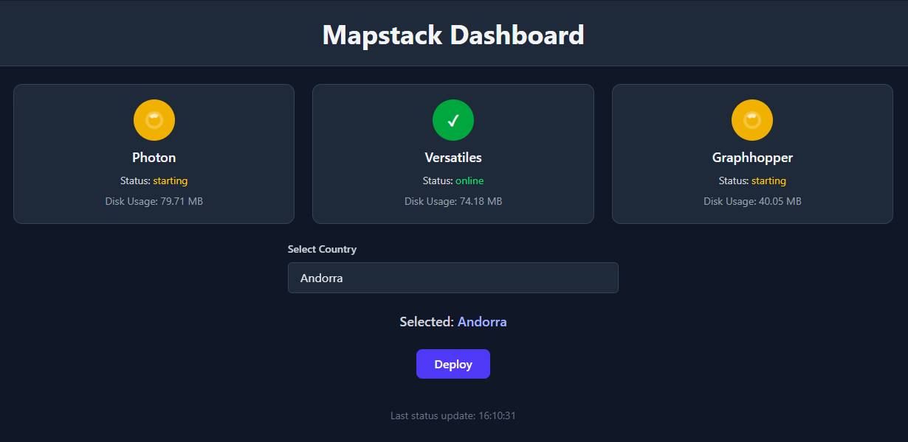

# Mapstack by CodingKiwi

**Mapstack** is a set of Docker images that lets you fully self-host routing, geocoding, and map tiles. Once the country data is downloaded, all services can run **offline**. Running a single country requires **minimal storage, RAM, and CPU**, making it lightweight and easy to deploy.

It consists of three core images:

| Image                                                                            | Purpose   | Based on                                                       |
| -------------------------------------------------------------------------------- | --------- | ------------------------------------------------------------- |
| [mapstack-graphhopper](https://hub.docker.com/r/codingkiwi/mapstack-graphhopper) | Routing   | [GraphHopper](https://github.com/graphhopper/graphhopper)     |
| [mapstack-photon](https://hub.docker.com/r/codingkiwi/mapstack-photon)           | Geocoding | [Photon](https://github.com/komoot/photon)                    |
| [mapstack-versatiles](https://hub.docker.com/r/codingkiwi/mapstack-versatiles)   | Tiles     | [Versatiles](https://github.com/versatiles-org/versatiles-rs) |

## Why Mapstack?

* Fully self-hostable map stack.
* Often you do not need the whole planet, running a single country uses very little storage, RAM, and CPU.
* Easy to deploy with docker compose in either **Managed** or **Standalone (.env)** mode.

---

## Getting Started

Mapstack can run in **Managed Mode** (recommended) or **Standalone (.env) Mode**.

### Managed Mode (Recommended)

Managed mode deploys all Mapstack services together via docker compose, with a ready-to-use admin interface.

**Included services:**

* `codingkiwi/mapstack-graphhopper` - routing
* `codingkiwi/mapstack-photon` - geocoding
* `codingkiwi/mapstack-versatiles` - map tiles and versatile maplibre assets (fonts/sprites)
* `codingkiwi/mapstack` - admin interface & gateway proxy
* `valkey` - configuration sync

Check `docker-compose.yaml` for a example

**Features:**

* Gateway exposes **all services under a single endpoint** (port 80).
  * /geocode
  * /tiles
  * /sprites
  * /fonts
  * /routing
* Admin interface (port 8080) allows selecting a country, downloading the data, and automatically restarting services.
  * can be disabled by setting `DISABLE_ADMIN` to `true`



### Standalone (.env) Mode

Each service can also run independently using environment variables. This mode is ideal for setups where the country selection is fixed.

Set `MANAGED=false` for each service.

Check `docker-compose.unmanaged.yaml` for an example.

Containers automatically download required files on startup.

| Container              | Env Variable | Example                      | Source                                                                                                         |
| ---------------------- | ------------ | ---------------------------- | -------------------------------------------------------------------------------------------------------------- |
| `codingkiwi/mapstack-graphhopper` | `REGION`     | `europe/iceland`             | [Geofabrik](https://download.geofabrik.de)                                                                     |
| `codingkiwi/mapstack-photon`      | `COUNTRY`    | `is`                         | [GraphHopper Public Extracts](https://download1.graphhopper.com/public/experimental/extracts/by-country-code/) |
| `codingkiwi/mapstack-versatiles`  | `BBOX`       | `13.091,52.334,13.74,52.676` | [Versatiles](https://download.versatiles.org/)                                                                 |

---

## Local Development

```bash
docker-compose -f docker-compose.dev.yaml up
```